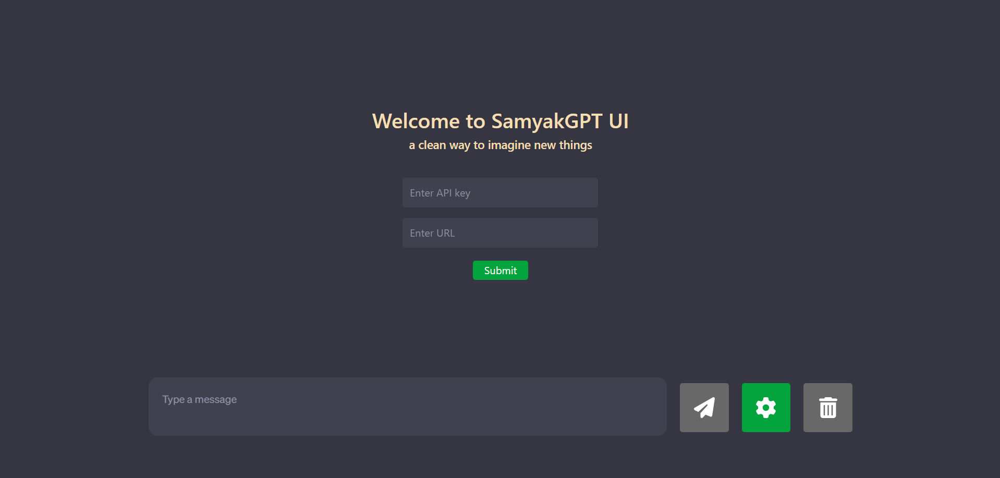

# [**SamyakGPTUI**](https://samyakgptui.is-an.app)

  

🚀 Welcome to My Awesome App! This application harnesses the power of OpenAI's GPT models, offering support for three different versions: `GPT 3.5 - Turbo`, `GPT 3.5 - Turbo - 16k`, and `GPT-4`.
 

-------------

## Features ✨

1. Engage in contextful conversations with any of the aforementioned models.
2. All three models have memory, allowing for seamless follow-up questions.
3. Plugin support for extended functionality.
4. Experience follow-up questions with enabled plugins as well.
 

-------------

## Plugins Implemented and How to Use Them 🧩

- **PromptPerfect Plugin:** Craft the perfect prompt with new details. Begin your prompt with `? ` followed by the desired text. For example - `? Create a story related to Harry Potter.`

- **webSearch Plugin:** Search the internet and get results directly within the app. Use the keyword `? ` followed by your question. For example - `? Who is the current president of India?`.

- **webPilot Plugin:** Read the contents of a URL/website and ask questions about it. Start with `? `, followed by the URL, and then your question. For example - `? "https://example.com" Summarize this.`
 

-------------

## Screenshots 📸

  

  

  

 

-------------

## Installation ⚙️

To install and run this application locally, follow these steps:

1. Clone the repository: `git clone https://github.com/Sammy970/SamyakGPTUI`
2. Change to the project directory: `cd SamyakGPTUI`
3. Install dependencies: `npm install`
4. Start the app: `npm start`
 

-------------

## Usage 💡

- Select your desired GPT model from the available options and dive right in.
- You can also choose from the available plugins - promptPerfect, webSearch, or webPilot. Follow the specific instructions for each plugin by asking the model itself to achieve the desired functionality.
 

-------------

## License 📝

This project is licensed under the [MIT License](https://opensource.org/licenses/MIT).

Feel free to explore, contribute, and let your creativity flow! 😄
